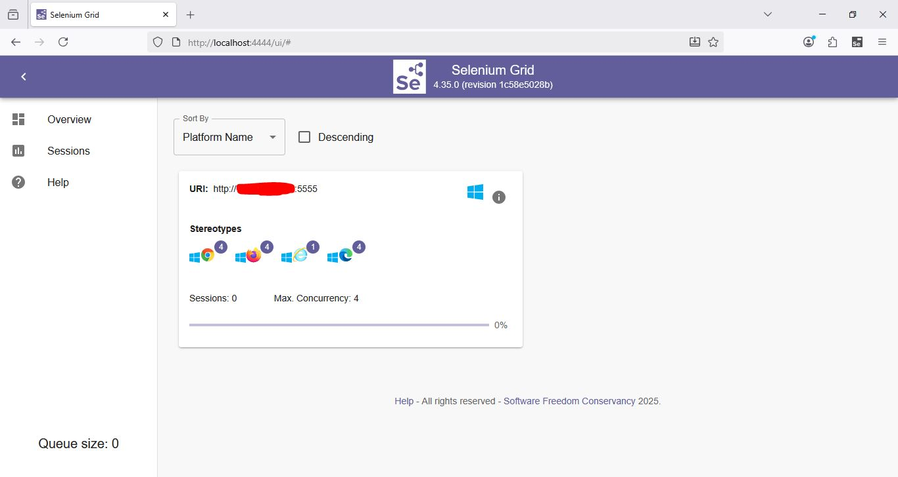
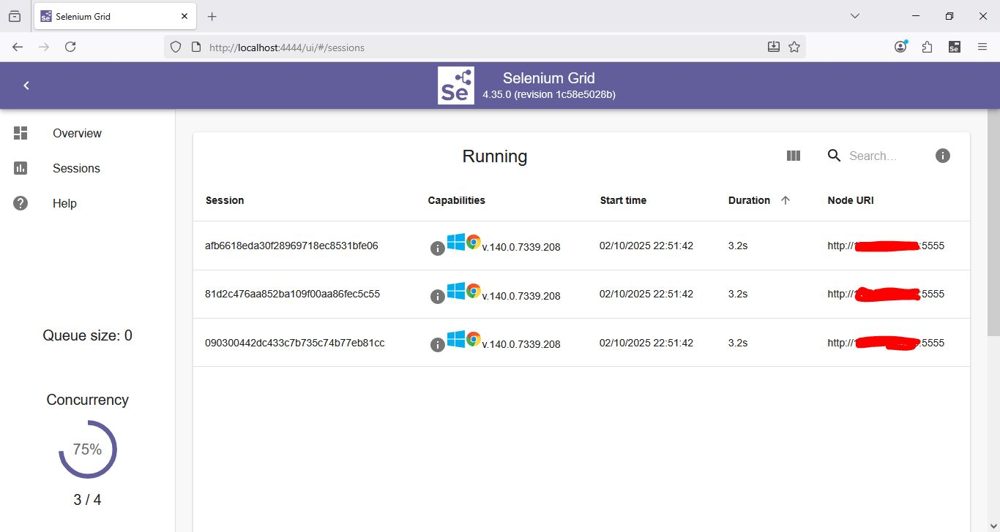
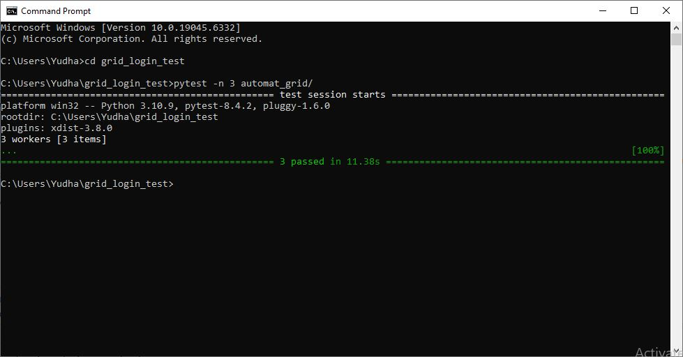
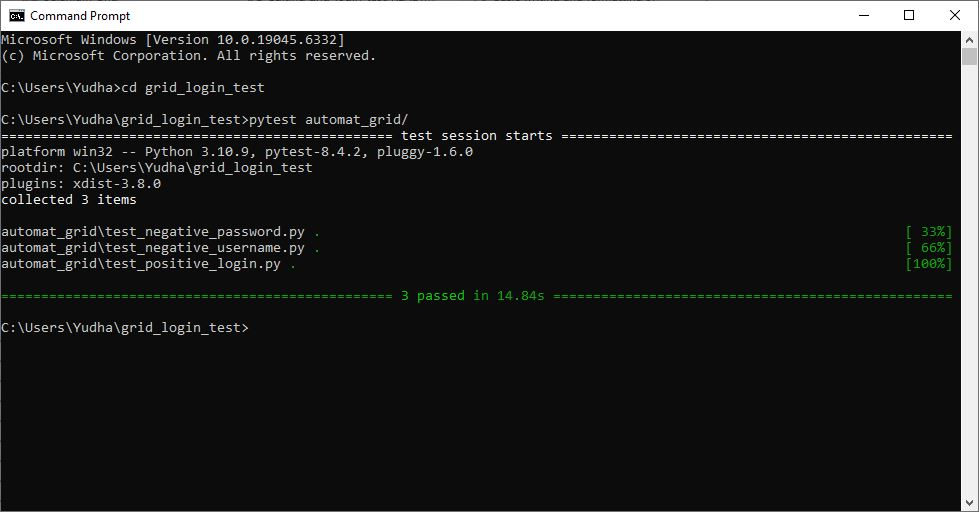

# grid_login_test
This mini project showcases my ability to run login test case scripts in parallel using Selenium Grid. There are three test cases in this mini project:
1. Positive login test
2. Negative username test
3. Negative password test

I configured one hub and one node from the same machine. The objective was to reduce tests execution time by running the tests in parallel using Selenium Grid.
## Prerequisites:
- Git installed
- Java installed
- Python installed
- `selenium` package installed
  ```
  pip install selenium
  ```
- Selenium Grid JAR downloaded (I'm using `selenium-server-4.35.0.jar` in this project)
- `pytest` package installed
  ```
  pip install pytest
  ```
- `pytest-xdist` package installed
  ```
  pip install pytest-xdist
  ```
## How to Run the Tests:
1. Open your terminal or command prompt.
2. Enter the following command
   ```
   git clone https://github.com/YudhaWidianto/grid_login_test.git
   ```
   This will clone the repository locally and create a folder called `grid_login_test` with all of the repo's files.
3. Start the grid hub.
   ```
   java -jar selenium-server-4.35.0.jar hub
   ```
4. Open [http://localhost:4444](http://localhost:4444) to see the Selenium Grid UI. Note that there are no registered nodes yet.
5. Open a new terminal window, and start a node.
   ```
   java -jar selenium-server-4.35.0.jar node
   ```
   Now you should see a node has been added in the Grid UI. My node's maximum concurrency is 4. Since there are only 3 tests, we will run the tests in parallel in the same node.
6. In order to run the tests, open another terminal window, change the current directory:
   ```
   cd grid_login_test
   ```
   Then, run:
   ```
   pytest -n 3 automat_grid/
   ```
   This tells `pytest-xdist` to run the test in `automat_grid` folder in 3 parallel threads. Three Chrome instances should run in parallel at this point.
## Result and Impact
By running the tests in parallel with Selenium Grid, I was able to run the tests in 11.38s instead of 14.84s by running the tests in sequence with command `pytest automat_grid/`.
## Notes
Since all tests run on the same browser and OS, and the tests didn't hit maximum concurrency of the node, I don't need to run the tests in multiple nodes for this mini project. To increase my skill, I plan to configure and run the tests in Chrome and Firefox browsers using two different nodes.
## Screenshots
- Selenium Grid UI after a node is added:
  
- Sessions tab on Selenium Grid UI shows all running sessions:
  
- Tests result after running `pytest -n 3 automat_grid/` (running three tests in parallel):
  
- Tests result after running `pytest automat_grid/` (running three tests in sequence):
  
